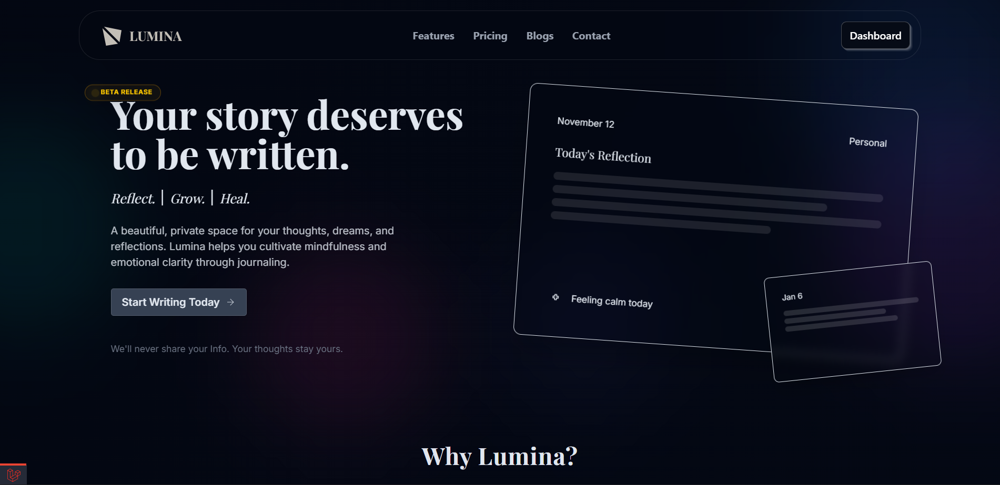
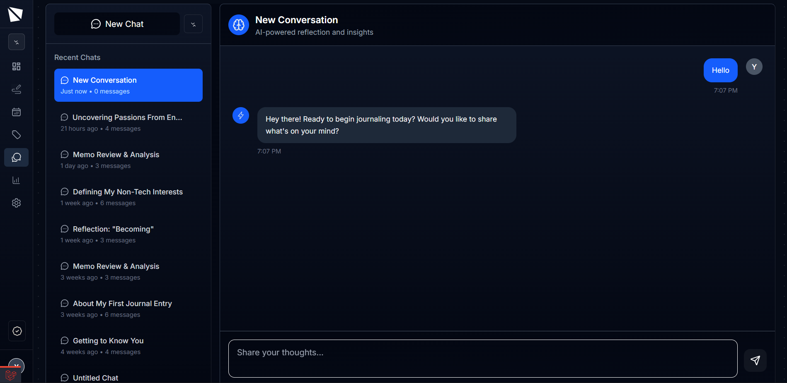

# Lumina 📝

Lumina is your personal digital diary and note-taking companion, built with Laravel. Capture your thoughts, organize your ideas, and gain insights from your daily entries—all in a beautiful, privacy-focused app.

---

## 🚀 Features

-   ✍️ **Rich Entry Creation:** Write, edit, and organize your notes and diary entries.
-   🏷️ **Tagging System:** Categorize entries with custom tags for easy retrieval.
-   🔍 **Powerful Search:** Instantly find entries with full-text search and filters.
-   📊 **Dashboard Insights:** Visualize your writing habits and trends.
-   🔒 **Secure & Private:** Your data stays yours—secure authentication and privacy-first design.
-   🌙 **Modern UI:** Responsive, dark-mode ready interface.

---

## 📸 Screenshots

<!-- Add your own screenshots here -->

---

## 🤝 Contributing

If you like Lumina, please consider starring the project! ⭐

Pull requests are welcome. For major changes, open an issue first to discuss what you would like to change.

---

## 📄 License

This project is licensed under the MIT License. See the [LICENSE](LICENSE) file for details.

---

> Made with ❤️ using Laravel
